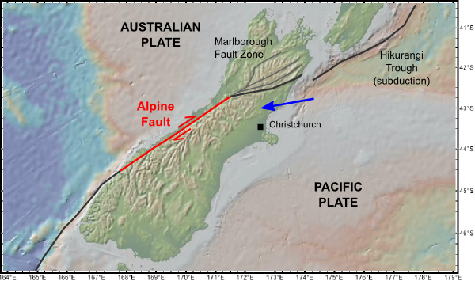
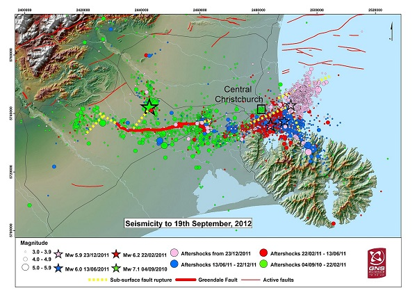

**Disclaimer**
I am not a seismologist.  This analysis is for education purposes only and should not be used for any other purposes.   

# Background to Canterbury Earthquakes Analysis 

New Zealand is a seismically active country, but the distribution of earthquakes is not uniform, rather they are more prevalent along the tectonic boundary separating the Australian Plate from the Pacific Plate.  

Prior to 2010, few people believed the city of Christchurch in the South Island's Canterbury region was at risk of earthquake given that the most obvious manifestation of the plate boundary in the South Island is not on the Canterbury Plains, but in the western foothills of the Southern Alps.  

  

But that all changed in September 2010 when the region was struck by a magnitude 7.1 earthquake, luckily causing no fatalities.  The region was subsequently struck by another of magnitude 6.3 in February 2011, this time killing 185 people and adding to the damage from the previous event, estimated at $NZ40 billion.

A previously hidden fault line was the cause of these earthquakes and GNS Science experts have plotted its location and named it the Greendale Fault.

# Analysis of Canterbury Earthquake Data

This analysis project explores seismic data collected by GeoNet and made publicly available and specifically asks:  

1. What did seismic activity in Canterbury look like before and after September 2010?  
2. Can you use the seismic data to calculate the amount of energy released by earthquakes?  
3. Can analysis of seismic data indicate  where the previously unknown fault line might be?  
4. How can analysis of seismic data help with earthquake prediction?    

Each of these questions is explored on its own tab in the main page.  

Controls in the side navigation enable some interactive exploration of the dataset.

## Using the Earthquake App

You can use the date sliders to change the start and end dates of the earthquake data.  This lets you see things like how seismically stable Canterbury was before September 2010 or how long seismic activity lasted after the major earthquakes.

You can use the check boxes to select all earthquakes or only those greater than magnitude 3.0 (a commonly used boundary as humans generally don't notice earthquakes below 3.0) or to use different scales in the earthquake prediction tab.

You can also download the filtered dataset as a .csv file so you can do some analysis of your own.

Have a play.

# The Technical Stuff

This app is written in R and Shiny and uses the shinythemes package to change the standard UI to something a little nicer.   It also uses a number of R packages as stated below.

## Data Processing

The data for this project was sourced from GeoNet (see acknowledgements below).  The data catalogue that describes the fields can be found here: 
[Data Catalogue](http://info.geonet.org.nz/display/appdata/Catalogue+Output)  

Data is cleansed to remove non-earthquake data (such as quarry blasting) and to implement the data rounding suggestions located in the GeoNet data catalogue.  In addition, the energy released by each earthquake is calculated and added to the dataset. 

lubridate and dplyr are used in data cleansing.

### Energy Calculations

Energy release is calculated using the formula:  

Energy(in Joules) = 10^(1.5*Magnitude + 4.8)  

As described by the Gutenberg / Richter energy-magnitude formula.  (Note: The constant '4.8' is stated as '4.4' in some articles.)    

Conversion of the energy to an equivalent 'tons of TNT' uses 4.184e9 Joules as being equal to one ton of TNT.   

## Shiny Controls and Visualisation Packages

As this is an educational project, a range of shiny widgets and controls are used to demonstrate some of shiny's versatility.  

Plotly is used with ggplot to make interactive plots.  

ggmap is used with ggplot to overlay a Google map over a latitude/longitude plot

## Acknowledgements

GeoNet is sponsored by the New Zealand Government through its agencies: Earthquake Commission (EQC), GNS Science and Land Information New Zealand (LINZ)  

I acknowledge the New Zealand GeoNet project and its sponsors EQC, GNS Science and LINZ, for providing the data used in this project.  

Copyright (2016)
